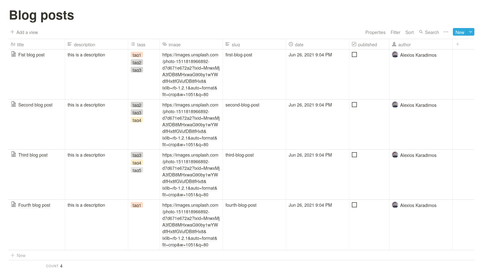

GraphQL server for Notion API
=============================

A simple GraphQL server for the Notion API using NextJS and Apollo Server (micro)

## Features

- [x] Dynamic Types schema generation based on Notion Databases
- [x] Dynamic Get Resolvers generation based on Notion Databases
- [ ] Update mutators
- [ ] Delete mutators
- [x] Notion API Caching (To reduce number of calls to the Notion API)

## Examples

### Database

Consider the following Notion database, on its own page


then an example query for this database is the following (the schema was generated automatically)
```graphql
query {
	blogPosts {
    id
    created_time
    children {
      results {
        type
        ...on GenericTextAndChildrenBlock {
          text
        }
      }
    }
  }
}
```

## Deployment

Deploy the example using [Vercel](https://vercel.com?utm_source=github):

[](https://vercel.com/new/git/external?repository-url=https://github.com/karadalex/nextjs-notion-graphql)

